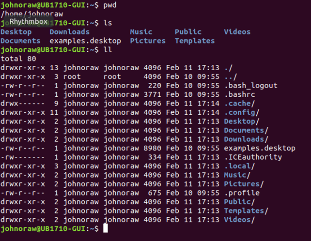

# Directories and File Structures

Directories would be hard to use if you didn't know which one you were working in!! The directory we are currently in is called the _working directory_ or sometime the _current directory_. We have previously seen how to tell what directory we are in DOS. Now we know where we are the next requirement is to see what files are there.&#x20;

In Unix, when you first login, your current working directory is your home directory. Your home directory normally has the same name as your username, for example, **/home/**_**your.name**_. This is where your personal files and subdirectories are saved.&#x20;

**pwd** to print the working directory path

**ls** to get a basic listing of the contents of the directory.&#x20;

**ll** or **ls -l** gives a long listing with quite a bit more information&#x20;

**ll --help** to get a list of options

<figure><figcaption></figcaption></figure>

Depending on your OS and how you are viewing it, some of the directory listings shows file names in various colours.&#x20;

* On the left, I can see if the entry is a file or directory (d or “-”).
* There are sets of permissions which we will look at in later notes (rwxrwxrwx).
* I can see the number of entries, files or directories (a number) associated with this directory.
* I can see the owner and group associated with the file (johnoraw for both).
* The size is presented, in bytes.
* The file modified date and time is displayed.
* And finally, the filename.

Some of the directory listing shows file names in blue; these are directories which in turn may hold files. A directory under another directory is referred to as a sub-directory.&#x20;

There may be no files visible in your home directory, in which case, the Unix prompt will be returned. Alternatively, there may already be some files inserted by the System Administrator when your account was created.

**ls** does not, in fact, cause all the files in your home directory to be listed, but only those ones whose name does not begin with a dot (.) Files beginning with a dot (.) are known as hidden files and usually contain important program configuration information. They are hidden because you should not change them unless you are very familiar with UNIX!!!

## In either DOS or Unix

(.) means the current directory, so typing **cd .** means stay where you are.&#x20;

(..) means the parent of the current directory, so typing **cd ..** will take you one directory up the hierarchy. These become very important later!!&#x20;

For completeness, I should comment that this overview is simplified. Files may be multi-dimensional; they may have other _streams_ apart from the one holding the data. Do an Internet search on NTFS streams to see what I mean.
